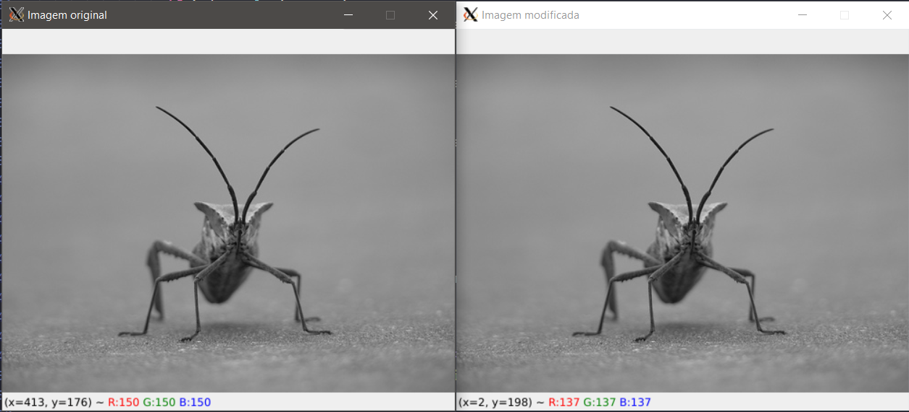

<p>Instituto Federal de Brasília</p>

<p> Disciplina: Processamento Digital de Imagens</p>

<p> Professor: Raimundo Vasconcelos</p>

<p> Aluno(a): Cinthia Mie Nagahama Ungefehr</p>

---

# <p style="text-align: center;">Relatório: Esteganografia</p>

<h2 id="intro"> 1. Introdução </h2>

<p style="text-align: justify;">

Da origem grega, _estegano_ - esconder e _grafia_ = escrita, a palavra esteganografia se refere à arte da escrita escondida, ao ato de ocultar mensagens em outros meios. <br>

Sempre com o objetivo de permitir o compartilhamento de informações de forma discreta, a esteganografia se mostrou através da história humana por meio de diversas formas: tintas invisíveis, micropontos, arranjo de caracteres (_character arrangement_), imagens com informações escondidas. <br>

Esse último caso, é o que será abordado no presente trabalho. Mais especificamente utilizando-se da técnica LSB (_Least Significant Bit_). Essa técnica consiste na alteração do bit menos significativo de cada pixel de uma imagem para esconder uma informação. <br>

Nesse trabalho será implementado um programa na linguagem Python com a ajuda da biblioteca OpenCV para codificação e decodificação de mensagens de texto em imagens no formato PNG (_Portable Network Graphics_). Para teste será utilizado o WSL2 (_Windows Subsystem for Linux_) com distribuição linux Ubuntu 20.04.<br>

</p>

<h2 id="encode"> 2. Codificar </h2>

Para codificar a imagem foi criado o programa _encode.py_ que deve ser executado com os seguintes argumentos:

```shell
python3 encode.py -e <nome da imagem de entrada> -s <nome da imagem de saída> -m <arquivo com a mensagem secreta> -b <valor do plano de bits>
```

Para teste, uma das imagens utilizadas foi:


com a seguinte mensagem:

```
0987654321

segredo shhhh

É mt secreto!

Não conta pra ninguém

!@#$%äüï&*
```

A função _encode()_, mostrada a seguir, é a responsável por guiar o processo de codificação da imagem.

```python
def encode():
    [og_image_name, text_file_name, bits_plan, out_image_name] = get_args(sys.argv[1:])

    og_image = get_image(og_image_name)
    og_image = cv2.cvtColor(og_image, cv2.COLOR_BGR2RGB)

    with open(text_file_name) as f:
        message = convert_to_binary(f.read() + ";;;;;")

    new_image = hide_message(og_image, bits_plan, message)

    og_image = cv2.cvtColor(og_image, cv2.COLOR_RGB2BGR)
    new_image = cv2.cvtColor(new_image, cv2.COLOR_RGB2BGR)
    show_images("Imagem original", og_image, "Imagem modificada", new_image)

    save_image(out_image_name, new_image)

    canal = {"0": "Vermelho", "1": "Verde", "2": "Azul", "3": "Todos"}
    print(f"canal modificado: {bits_plan} -> {canal[str(bits_plan)]}")
```

Primeiramente, com o seguinte trecho de código, extrai-se os valores dos argumentos: nome da imagem original localizada no mesmo diretório que o programa, nome do arquivo onde está o texto a ser escondido, o plano de bits a ser alterado e o nome da imagem codificada, respectivamente.

```python
[og_image_name, text_file_name, bits_plan, out_image_name] = get_args(sys.argv[1:])
```

Em seguida, a imagem original é importada para o programa e, para facilitar a localização do plano de bits a ser alterado, altera-se o formato BGR (_Blue-Green-Red_) nativo do OpenCV para o formato RGB (_Red-Green-Blue_).

```python
og_image = get_image(og_image_name)
og_image = cv2.cvtColor(og_image, cv2.COLOR_BGR2RGB)
```

No passo seguinte extrai-se a mensagem secreta do arquivo de texto e adiciona-se um delimitador, que servirá para indicar o fim da mensagem. Depois disso, converte-se a mensagem para binário com a função _convert_\__to_\__binary()_ mantendo um formato de 8 bits para cada caracter.

```python
with open(text_file_name) as f:
    message = convert_to_binary(f.read() + ";;;;;")
```

```python
def convert_to_binary(message):
    if type(message) == str:
        return ''.join([format(ord(letter), "08b") for letter in message])
    elif type(message) == bytes or type(message) == np.ndarray:
        return [format(i, "08b") for i in message]
    elif type(message) == int or type(message) == np.uint8:
        return format(message, "08b")
    else:
        raise TypeError("Tipo de dado não aceito")
```

Então, utiliza-se a função _hide_\__message()_ para esconder a mensagem no bit menos significativo (LSB) do plano de bits escolhido.

```python
new_image = hide_message(og_image, bits_plan, message)
```

a função _hide_\__message()_ primeiro checa se a mensagem cabe no plano de bits escolhido ou na imagem como um todo se todos os planos de bits tiverem sido escolhidos. Em seguida, dentro dos laços aninhados converte-se os valores do pixel em questão em um binário e troca-se, em seguida, o bit mais a direita por um bit da mensagem a ser escondida. Quando toda a mensagem for escondida na imagem, retorna-se a imagem alterada para a função _encode()_.

```python
def hide_message(image, bits_plan, message):
    max_size = image.shape[0] * image.shape[1]

    if (bits_plan < 3) & (len(message) > max_size):
        raise ValueError(
            "A mensagem é grande demais para o plando de bits escolhido")
    elif len(message) > (max_size * 3):
        raise ValueError("A mensagem é grande demais para a imagem escolhida")

    index = 0
    len_message = len(message)
    new_image = image.copy()

    if(bits_plan < 3):
        for values in new_image:
            for pixel in values:
                rgb = dict(zip(["0", "1", "2"], convert_to_binary(pixel)))

                pixel[bits_plan] = int(
                    rgb[str(bits_plan)][:-1] + message[index], 2)
                index += 1

                if index >= len_message:
                    return new_image
    else:
        for values in new_image:
            for pixel in values:
                rgb = dict(zip(["0", "1", "2"], convert_to_binary(pixel)))

                if index < len(message):
                    pixel[0] = int(rgb["0"][:-1] + message[index], 2)
                    index += 1
                if index < len(message):
                    pixel[1] = int(rgb["1"][:-1] + message[index], 2)
                    index += 1
                if index < len(message):
                    pixel[2] = int(rgb["2"][:-1] + message[index], 2)
                    index += 1

                if index >= len_message:
                    return new_image
```

De volta a função _encode()_, converte-se ambas as imagens para o formato BGR para que se possa exibir ambas as imagens.

```python
og_image = cv2.cvtColor(og_image, cv2.COLOR_RGB2BGR)
new_image = cv2.cvtColor(new_image, cv2.COLOR_RGB2BGR)
show_images("Imagem original", og_image, "Imagem modificada", new_image)
```

<!--  -->



Dando zoom nas imagens, é possível ver os valores que foram alterados no canal vermelho.


As imagens podem ser fechadas clicando no "x" da janela da imagem ou clicando a tecla "q" no teclado. Após se fechar as imagens, o programa continua, salvando a imagem alterada e imprimindo no terminal o canal modificado.

```python
save_image(out_image_name, new_image)

canal = {"0": "Vermelho", "1": "Verde", "2": "Azul", "3": "Todos"}
print(f"canal modificado: {bits_plan} -> {canal[str(bits_plan)]}")
```

<h2 id="decode"> 3. Decodificar </h2>

Para decodificar uma mensagem escondida em uma imagem, foi criado o programa _decode.py_ que deve ser chamado com os seguintes argumentos: nome da imagem que foi modificada, nome do arquivo onde escrever a mensagem secreta e plano de bits que foi alterado.

```shell
python3 decode.py -i <nome da imagem de entrada> -a <nome do arquivo de saída> -b <valor do plano de bits>
```

Assim como o programa de codificação, o programa de decodificação tem uma função que guia o processo, essa é a função _decode()_.

```python
def decode():
    [image_name, text_file_name, bits_plan] = get_args(sys.argv[1:])

    mod_image = get_image(image_name)
    mod_image = cv2.cvtColor(mod_image, cv2.COLOR_BGR2RGB)

    message = find_message(mod_image, bits_plan)

    with open(text_file_name, "w") as f:
        f.write(message)
```

Iniciando de forma muito similar à _encode()_, primeiramente extrai-se os argumento da chamada do programa e importa-se a imagem modificada, alterando a para o formato RGB.

Em seguida é chamada a função _find_\_\_message() para extrair da imagem a mensagem escondida. Essa função pode ser dividida, conceitualmente, em duas partes.

A primeira parte dessa função tem o propósito de passar pela matriz da imagem coletando todos os bits menos significativos do(s) plano(s) de bits escolhidos.

```python
def find_message(image, bits_plan):
    binary_data = ""

    if(bits_plan < 3):
        for values in image:
            for pixel in values:
                rgb = dict(zip(["0", "1", "2"], convert_to_binary(pixel)))

                binary_data += rgb[str(bits_plan)][-1]
    else:
        for values in image:
            for pixel in values:
                rgb = dict(zip(["0", "1", "2"], convert_to_binary(pixel)))

                binary_data += rgb["0"][-1]
                binary_data += rgb["1"][-1]
                binary_data += rgb["2"][-1]
```

Já na segunda parte é feita a conversão dos dados binários extraídos anteriormente. Primeiro separa-se os dados em conjuntos de tamanho 8, pois, durante a codificação, foi mantido um tamanho de 8 bits por caracter. Em seguida cada conjunto de 8 bits é transformado em um caracter ASCII, até que se encontre o delimitador do final da mensagem.

```python
    binary_data = [binary_data[i: i + 8] for i in range(0, len(binary_data), 8)]

    message = ""
    for word in binary_data:
        message += convert_to_ascii(word)
        if(message[-5:] == ";;;;;"):
            break

    return message[:-5]
```

Com a mensagem retornada pela função _find_\_\_message(), escreve-se essa mensagem em um arquivo de texto com o nome dado na chamada do programa.

```python
with open(text_file_name, "w") as f:
    f.write(message)
```

<h2 id="validation"> 4. Argumentos e Validações </h2>

O programa _encode.py_ recebe seus argumentos no formato:

```shell
python3 encode.py -e <nome da imagem de entrada> -s <nome da imagem de saída> -m <arquivo com a mensagem secreta> -b <valor do plano de bits>
```

Esses argumentos são recebidos e validados pela função _get_\__args()_.

```python
def get_args(argv):
    og_image = ''
    text_file = ''
    bits_plan = ''
    out_image = ''

    try:
        opts, _ = getopt.getopt(argv, "he:s:m:b:", [
                                "help", "imagem-entrada=", "imagem-saida=", "mensagem=", "plano-bits="])
    except getopt.GetoptError:
        raise SystemExit(print_help())

    for opt, arg in opts:
        if opt in ("-h", "--help"):
            raise SystemExit(print_help())
        elif opt in ("-e", "--imagem-entrada"):
            og_image = arg
        elif opt in ("-s", "--imagem-saida"):
            out_image = arg
        elif opt in ("-m", "--mensagem"):
            text_file = arg
        elif opt in ("-b", "--plano-bits"):
            bits_plan = int(arg)

    if(og_image == out_image):
        print(
            "Aviso: nome da imagem de entrada é igual ao nome da imagem de saída. A imagem original será sobescrevida.\nContinuar mesmo assim? [Y/N]")
        if(input().upper() == "N"):
            sys.exit()

    if(not isinstance(bits_plan, int) and (bits_plan < 0 or bits_plan > 4)):
        raise ValueError("Plano de bits deve ser um valor inteiro entre 0 e 3")

    return [og_image, text_file, bits_plan, out_image]
```

A função _get_\__args()_ utiliza a biblioteca _getopt_ para designar _flags_ e diferenciar os argumentos passados. Dessa forma, a ordem em que os argumentos são passados não influencia em seus valores. Caso um argumento esteja faltando ou a sintaxe esteja incorreta uma mensagem de ajuda explicando cada _flag_ será mostrada no terminal.


Ainda nessa função será validado o nome das imagens, permitindo que o usuário pare o programa caso as imagens de entrada e saída possuam o mesmo nome, e o valor do plano de bits, que deve estar entre 0 e 4.

Na função _get_\__image()_ , chamada pela função _encode()_, é checada a existência da imagem, terminando o programa com uma mensagem de erro caso esta não seja encontrada.

```python
def get_image(image_name):
    image = cv2.imread(image_name)

    if(isinstance(image, np.ndarray)):
        return image
    raise FileNotFoundError("Imagem não encontrada")
```

O programa _decode.py_ também tem passa por validações, contudo, elas são as mesmas utilizadas na validação dos argumentos do _encode.py_: presença de todos os argumentos necessários, validação do valor do plano de bits e existência da imagem.

<h2 id="conclusion"> 5. Considerações Finais </h2>

Dos testes realizados com o programa, chegou-se a algumas conclusões:

- Os programas foram testados com ambas imagens monocromáticas e coloridas, funcionando normalmente desde que estas possuam três canais de cores.

- Os programas podem gerar resultados inesperado caso a mensagem a ser codificada/decoficada contenha caracteres especiais que necessitem de mais do que 8 bits quando convertidos para a tabela ASCII.

- Os programas foram feitos tendo como base a tabela ASCII, logo outras formatações de texto podem gerar erros.

- Os programas foram testados apenas com imagem de formato .png e arquivos de texto .txt, outros formatos de entrada/saída podem gerar erros.
